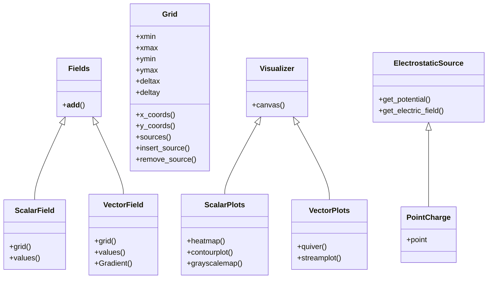

# Electric Field Visualizer

## Overview

Electric Field Visualizer is a Python application for calculating and visualizing electric fields generated by electrostatic point sources. The project uses NumPy for numerical field calculations and Matplotlib for visualization, with a modular architecture separating the domain, mathematical operations, physics models, source generation, and visualization components.

## Contributors

* Ibrahim Mira
* John Fanourakis
* Darren Kuo

## Demo

The visualizer calculates the electric potential and vector electric field generated by electrostatic point sources across a two-dimensional domain. Multiple visualization methods can be used to represent the calculated field.

### Vector Field Visualization

<p align="center">
    

</p>

<p align="center">
    Electric field represented using a vector field with electric potential shown by the color map.
</p>

### Field Line Visualization

<p align="center">
    
</p>

<p align="center">
    Electric field visualized using streamlines with equipotential contours surrounding the point source.
</p>

## Project Structure

The application is organized into several modules that separate the electric field calculations, source generation, and visualization logic.

- **Domain:** Defines the core objects and data structures used throughout the application.
- **Factories:** Handles the creation of electrostatic source configurations.
- **Math:** Provides mathematical operations used in field calculations.
- **Physics:** Implements the electric field calculations for electrostatic sources.
- **Visuals:** Generates visualizations of the calculated electric fields using Matplotlib.

## UML Class Diagram

The class diagram below illustrates the primary components used for field representation, electrostatic sources, and visualization.



## Theory and Implementation

The visualizer models electric fields and electric potential generated by electrostatic point charges. For a point charge, the electric field is calculated using:

$$
\vec{E} = \frac{kQ}{r^2}\hat{r}
$$

where $k$ is Coulomb's constant, $Q$ is the source charge, and $r$ is the distance from the charge to the point being evaluated.

Electric potential is calculated using:

$$
V = \frac{kQ}{r}
$$

For multiple point charges, the resulting electric field is calculated using the principle of superposition by summing the individual electric field vectors. The resulting scalar potentials are similarly combined to generate the potential visualizations.

## Testing and Test-Driven Development

The project was developed using a test-driven development (TDD) approach. Tests were written to define expected behavior before implementing or modifying functionality, allowing individual components to be validated throughout development.

The test suite covers core functionality including mathematical operations, electric field calculations, domain behavior, and source generation. Tests were run throughout development to identify regressions as the application evolved.

## Running the Project

The included demonstrations can be run from the project root using Python's module execution:

```bash
python -m src.demo_1
```

or
```bash
python -m src.demo_2
```

## Documentation

Project documentation was developed using Sphinx to document the application's modules and code structure. Documentation source files are available in the `docs` directory.


